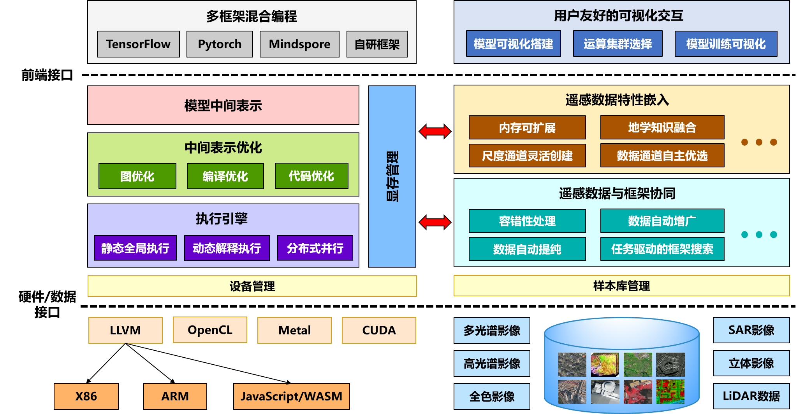

<!-- /TOC -->

## LuoJiaNet介绍
遥感专用机器学习框架LuoJiaNET,由武汉大学LuoJiaNET框架团队与华为MindSpore框架研究小组联合打造而成， 是遥感领域首个国产化自主可控的遥感专用机器学习框架，针对遥感数据像幅尺寸大、数据通道多、尺度变化大等特性， 具备内存可扩展、尺度通道灵活创建、数据通道自主优选、框架与数据协同处理的特点。可兼容已有深度学习框架， 并提供用户友好的、可拖拽的交互式网络结构搭建界面的方法。能屏蔽不同硬件设备间差异，同时管理多样化的遥感影像样本库LuoJiaSET， 实现遥多源感影像样本的高效存储管理。

LuoJiaNET同时与国产人工智能硬件NPU深度融合，可同时支持CPU、GPU、NPU等硬件资源，使智能计算软硬件充分协同，形成融合探测机理与地学知识的统一计算图表达、编译优化、图算融合、 自动混合并行的新一代遥感智能解译框架，可进行遥感样本自动提纯与增广，充分融合探测机理与地学知识。



1. 请参照[LuoJiaNet安装手册](https://whu.obs.cn-central-221.ovaijisuan.com/instruction/index.html) 安装[whl包](https://gitee.com/mindspore/luojianet/tree/master/whl_files/download)或源码编译安装

2. 执行以下命令，验证安装结果。

    ```python
    import numpy as np
    import luojianet_ms.context as context
    import luojianet_ms.nn as nn
    from luojianet_ms import Tensor
    from luojianet_ms.ops import operations as P

    context.set_context(mode=context.GRAPH_MODE, device_target="CPU")

    class Mul(nn.Module):
        def __init__(self):
            super(Mul, self).__init__()
            self.mul = P.Mul()

        def call(self, x, y):
            return self.mul(x, y)

    x = Tensor(np.array([1.0, 2.0, 3.0]).astype(np.float32))
    y = Tensor(np.array([4.0, 5.0, 6.0]).astype(np.float32))

    mul = Mul()
    print(mul(x, y))
    ```

    ```text
    [ 4. 10. 18.]
    ```

3. LuoJiaNET安装手册中，相应的源码见[tutorial](https://gitee.com/mindspore/luojianet/blob/master/examples/tutorial)

## 版本说明

版本说明请参阅[RELEASE](https://gitee.com/mindspore/luojianet/blob/master/RELEASE.md)。

## 许可证

[Apache License 2.0](https://gitee.com/mindspore/luojianet/blob/master/LICENSE)
