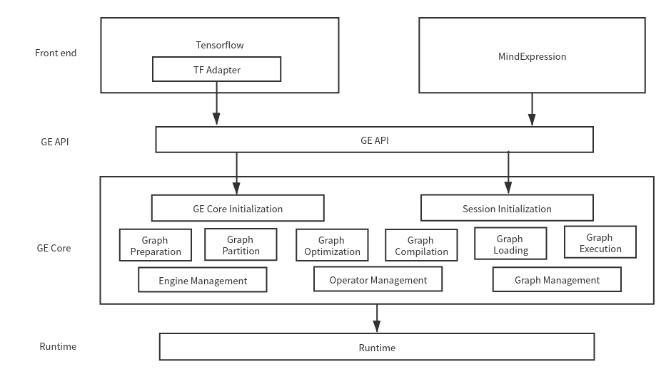

[查看中文](./README_CN.md)

  GraphEngine(GE) is a sub-module of LuoJiaNet connecting the front end and devices which was designed by the researches and engineers within Huawei Technologies Co.,Ltd. GE is implemented via C++. It takes the graph of front end as its input and a series of graph operations are carried out to adapt the graph to a certain form which can be effectively operated on devices. GE is specifically designed for an efficient operation on Ascend Chips. GE is automatically called without any exposure to the users. GE mainly consists of two parts, i.e. GE API and GE Core. The architecture diagram of GE is illustrated as follows



- GE API

  GE API is the interface between GE Core and front end which controls the initialization and finalization of GE Core and Sessions. It also provides the interfaces for graph adding and running.

- GE Core

  GE Core acts as the core module of GE and is responsible for graph processing operations. It consist of six parts, i.e. graph preparation, graph partition, graph optimization, graph compilation, graph loading and graph execution. These six parts are performed in series and all together complete the complicated graph processing operations.

  - Graph preparation & Whole graph optimization

    All the shapes of feature maps and variables in the graph are inferred in this stage for memory allocation later. Some aggregations of operators like allreduce are performed as well. 

  - Graph partition

    Ascend Chips are heterogeneous chips including CPUs and vector calculation units, i.e. AICORE. Each operator in the graph is assigned to a certain operating cores according to the costs and supports. These two cores correspond to two different abstract engines in software. The whole graph is split into several sub-graphs based on the assigned engine in previous stage. Certain operators are added to the sub-graphs as the marks for graph edges. Such a partition enables an efficient optimization, compilation in next stages.

  - Subgraph optimization

    Different optimizer interfaces are called due to different engines that each sub-graph belongs to. To thoroughly utilize the calculation ability of the CUBE module in AICORE, A novel data layout format for faster hardware fetch is applied and the transition between normal 4D to this special format is performed in this stage. Such an operation guarantees less data handling between RAMs and CUBEs. Certain combination of operators is fused into a single big operator to further reduce the computation costs. This fusion is carried out in this stage as well.

  - Graph compilation & Graph loading

    GraphEngine uses real-time operator compilation technology, i.e. the operator executable program is generated at real time according to the network structure. Meanwhile, Memory allocation is completed considering memory reuse strategy in resources allocation stage. According to the graph information, the queue, event, stream resources are allocated. Each operator is compiled to a task bound to a certain stream. Tasks on the same stream are performed in series and task on different streams can be executed in parallel. In the Graph Loading stage, the operators of graph are assigned to different engines according to the engine information, and the graph is loaded on the devices for running.

  - Graph execution

    The graph is executed on devices efficiently in this stage and the corresponding outputs are returned to the hosts. For efficiency consideration, a sink mode is provided where the graph is executed several times with the last output returned. Such a mode effectively reduces the data handling between devices and hosts.

  In training or evaluating process, the aforementioned graph processing operations are carried out automatically. All in all, GE is a linked up module between LuoJiaNet front end and Ascend Chips aiming to adapt the graph designed by users to a more efficient form that can be directly executed on Ascend Chips.

- [Installation](#installation)
- [Community](#community)
- [Contributing](#contributing)
- [Release Notes](#release-notes)
- [License](#license)

# Installation

## Installing GraphEngine

GE is automatically installed and compiled once you finish installing LuoJiaNet. There are three dynamic link libraries corresponding to GE. 

## Installing Using the Source Code

You may also build GraphEngine from source.
To build GraphEngine, please make sure that you have access to an [Ascend 910](https://e.huawei.com/se/products/cloud-computing-dc/atlas/ascend-910) environment as compiling environment, and make sure that following software requirements are fulfilled.
 > - GCC >= 7.3.0
 > - CMake >= 3.14.0
 > - Autoconf >= 2.64
 > - Libtool >= 2.4.6
 > - Automake >= 1.15.1

 as your compiling environment and  have GCC version >= 7.3.0 and CMake version >= 3.14.0 installed. It is necessary to be using an Ascend 910 environment to build GraphEngine.
The output of building GraphEngine is a set of shared libraries which can be linked with LuoJiaNet, they are not meant to be used independently.

1. Download GraphEngine source code.

GraphEngine source code is available on [Gitee](https://gitee.com/luojianet_ms/graphengine):
```shell
git clone https://gitee.com/luojianet_ms/graphengine.git
cd graphengine
```
2. Run the following command in the root directory of the source code to compile GraphEngine:
To build with default options, simply:
```shell
bash build.sh
```
 > - Before running the preceding command, ensure that the relevant paths have been added to the environment variable PATH.
 > - In the build.sh script, the git clone command will be executed to obtain code from Gitee.com. Ensure that the network settings of Git are correct.
 > - In the build.sh script, the default number of compilation threads is 8. If the compiler performance is poor, compilation errors may occur. You can add -j{Number of threads} in to bash command to reduce the number of threads. For example, `bash build.sh -j4`.

3. Access the output directory of the source code, obtain the generated GraphEngine libraries which can be linked with LuoJiaNet for further installation/testing.

For more information on other options of building GraphEngine:
```shell
bash build.sh -h
```

If you wish to clean all outputs from last build and try again:
```shell
rm -rf build/ output/
bash build.sh
```

## Community

- [LuoJiaNet Slack](https://join.slack.com/t/luojianet_ms/shared_invite/enQtOTcwMTIxMDI3NjM0LTNkMWM2MzI5NjIyZWU5ZWQ5M2EwMTQ5MWNiYzMxOGM4OWFhZjI4M2E5OGI2YTg3ODU1ODE2Njg1MThiNWI3YmQ) - Ask questions and find answers.

## Contributing

Welcome contributions. See our [Contributor Wiki](https://gitee.com/luojianet_ms/luojianet_ms/blob/master/CONTRIBUTING.md) for more details.

## Release Notes

The release notes, see our [RELEASE](RELEASE.md).

## License

[Apache License 2.0](LICENSE)
