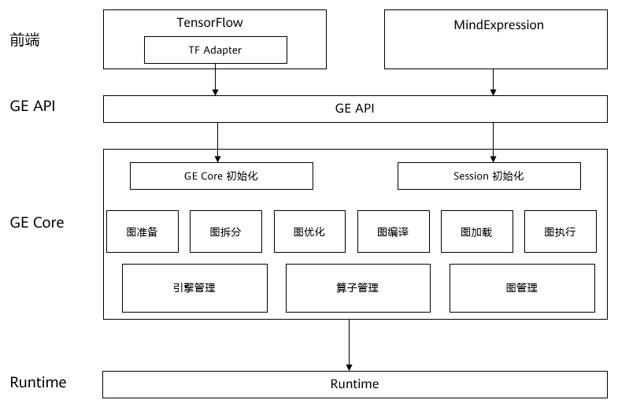

[View English](./README.md)

图引擎模块(GE)是LuoJiaNet的一个子模块，其代码由C++实现，位于前端模块ME和底层硬件之间，起到承接作用。图引擎模块以ME下发的图作为输入，然后进行一系列的深度图优化操作，最后输出一张可以在底层硬件上高效运行的图。GE针对昇腾AI处理器的硬件结构特点，做了特定的优化工作，以此来充分发挥出昇腾AI处理器的强大算力。在进行模型训练/推理时，GE会被自动调用而用户并不感知。GE主要由GE API和GE Core两部分组成，详细的架构图如下所示。

- GE API

    GE API是连接前端模块ME和GE Core的接口，负责GE Core中初始化、Session管理模块的接口，支持运行环境初始化，Session创建、销毁，图添加执行。

- GE Core

    GE Core是GE的核心模块，负责整个训练过程中的图管理。GE Core中的图处理可细分为六大步骤，分别是图准备、图拆分、图优化、图编译、图加载和图执行，对于ME下发的每一张图都会经过这六个步骤的操作，最终得到可以直接在底层硬件上高效执行的图。

    - 图准备 & 整图优化

      完成整图级别的数据准备和优化，涉及到IR库及算子库。使用IR库中算子的InferShape函数，完成整图的Shape推导，以便后续申请内存；同时根据算子的聚合属性，完成某些算子的聚合优化，如allreduce算子，会按照聚合参数，将若干各参数对应梯度的allreduce算子聚合为一个，以此减少通讯耗时。

    - 图拆分

      昇腾AI处理器是一种异构芯片，含有CPU(AICPU)和向量计算部件AICORE，图中每个算子会按照开销模型选择执行的核心，此阶段会对算子进行最优的核心分配，每种核心对应软件上的一个抽象引擎；按照之前对各算子的引擎分配，以引擎为边界，将整图拆分为若干子图，在图边界算子上插入相应的Placeholder算子以做标识，之后的优化、编译、加载操作均会以子图为单位进行，这样可以有效减少优化过程的耗时。

    - 子图优化

      根据子图所属引擎，调用不同的优化器接口执行优化。为了充分发挥昇腾AI处理器中AICORE模块的算力，在AICORE内CUBE单元进行计算的算子会采用一种5D的数据格式，图优化阶段会对相应算子进行4D/5D的类型转换；为了进一步发挥CUBE单元的算力，减少数据搬运次数，GE会对某种范式的算子连接进行融合操作，此步骤也在图优化阶段进行；对所有子图优化之后，需进行算子运行属性计算，以计算输入输出内存大小。
	
    - 图编译 & 图加载

      GE采用即时算子编译技术，即按照实际网络结构即时编译生成算子可执行程序，同时完成内存复用与内存分配、流分配、算子可执行程序加载等。每个算子执行任务绑定到特定的流上，同一个流的任务是串行执行的，不同流上的任务可以并行执行。图加载阶段按照引擎归属的runtime，将子图加载到硬件上准备执行。

    - 图执行

      最终在硬件上执行子图，并返回相应的输出值。为了提高运行效率，图执行阶段提供了一种下沉模式，可以在底层硬件上连续运行多轮再返回输出值，以此减少从底层硬件拷贝数据的次数。

在训练/推理过程中，上述过程会自动执行，通过上述图操作，GE可以将前端下发的图转换为一种可以在昇腾AI处理器上高效运行的图模式。

# 安装说明

## 安装GE

GE内嵌在LuoJiaNet安装包中，LuoJiaNet安装完毕后，GE以三个动态库的方式被调用。

## 源码安装

GE也支持由源码编译，请参考以下链接完成：
[个人开发工具链](https://gitee.com/luojianet_ms/graphengine/blob/master/scripts/readme.md)

## 社区

- [LuoJiaNet Slack](https://join.slack.com/t/luojianet_ms/shared_invite/enQtOTcwMTIxMDI3NjM0LTNkMWM2MzI5NjIyZWU5ZWQ5M2EwMTQ5MWNiYzMxOGM4OWFhZjI4M2E5OGI2YTg3ODU1ODE2Njg1MThiNWI3YmQ) - 可以提问和找答案。

## 贡献

欢迎参与贡献，更多信息详见[Contributor Wiki](https://gitee.com/luojianet_ms/luojianet_ms/blob/master/CONTRIBUTING.md)。

## Release Notes

Release Notes请参考[RELEASE](RELEASE.md).

## License

[Apache License 2.0](LICENSE)
