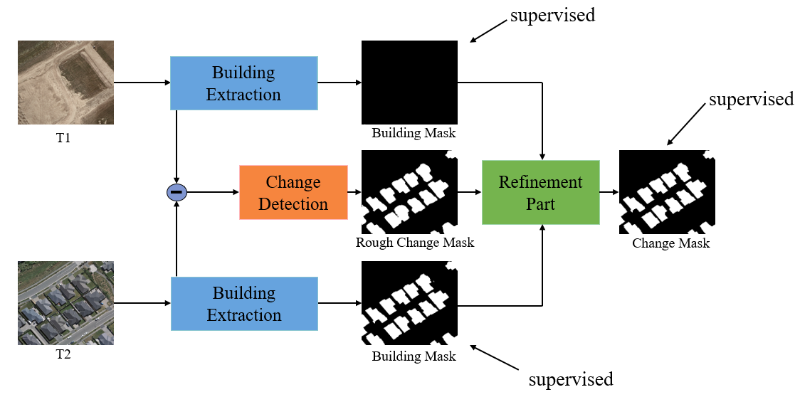

# 遥感影像变化检测
## 多任务共进的遥感影像建筑物变化检测方法
论文：2022RS《Built-Up Area Change Detection Using Multi-Task Network with Object-Level Refinement》  
链接：[https://doi.org/10.3390/rs14040957](https://doi.org/10.3390/rs14040957)  
代码提供者：[gaosong@whu.edu.cn](gaosong@whu.edu.cn)  

&emsp;
1. 下载遥感建筑物变化检测影像数据集，如WHU building ChangeDetection等
>WHU building ChangeDetection:http://gpcv.whu.edu.cn/data/building_dataset.html
2. 将数据集整理成如下格式：  
注意：A、B、building_A、building_B、label中的图片名字必须对应！  
其中，A，building_A分别为A时相影像以及对应的建筑物掩膜，B，building_B分别为B时相影像以及对应的建筑物掩膜，label为对应的变化掩膜

```
.. code-block::
        .
        └── image_folder_dataset_directory
             ├── A
             │    ├── 000000000001.jpg
             │    ├── 000000000002.jpg
             │    ├── ...
             ├── B
             │    ├── 000000000001.jpg
             │    ├── 000000000002.jpg
             │    ├── ...
             ├── building_A
             │    ├── 000000000001.jpg
             │    ├── 000000000002.jpg
             │    ├── ...
             ├── building_B
             │    ├── 000000000001.jpg
             │    ├── 000000000002.jpg
             │    ├── ...
             ├── label
             │    ├── 000000000001.jpg
             │    ├── 000000000002.jpg
             │    ├── ...
```
3. 根据需求修改train.py中的参数   
```
    image1_dir = './data/A' # A 时相图片路径
    image2_dir = './data/B' # B 时相图片路径
    label1_dir = './data/building_A' # A 时相建筑物标签路径
    label2_dir = './data/building_B' # B 时相建筑物标签路径
    label3_dir = './data/label' # 变化掩膜路径
    save_dir = './model' # 模型保存路径
    batch_size = 1 
    epochs = 150 # 训练次数
    LR = 1e-4 # 学习率
```
4. 设置完毕后，在cmd下运行``python train.py``进行训练
5. 训练好的模型会根据前面设置的参数保存在相应的目录下，选择合适的模型，使用test.py进行测试，在cmd下运行``python test.py``进行测试验证，其参数设置如下   
```
    imageval1_dir = './Building_change_detection/1/A' # test A时相影像路径
    imageval2_dir = './Building_change_detection/1/B' # test B时相影像路径
    weight_file = './model/CD-2_1.ckpt' # 模型路径
    result_dir = './result' # 结果存放路径
```