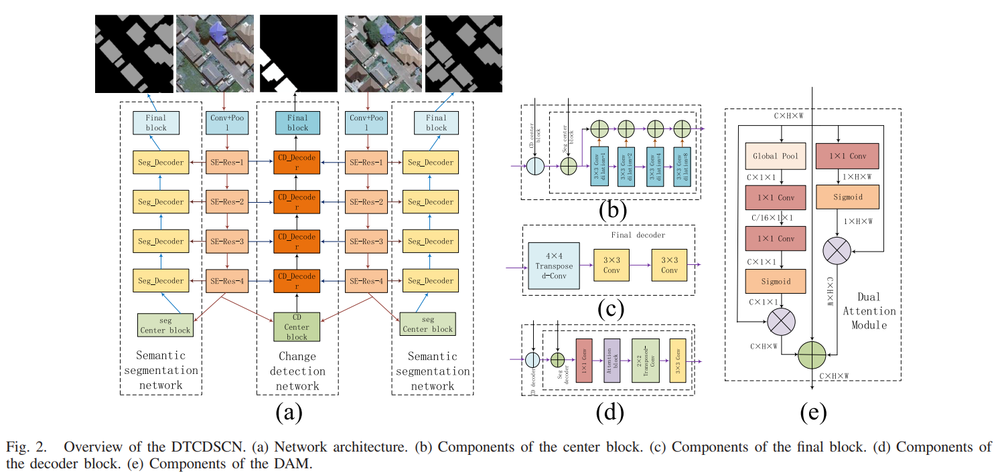

# 遥感影像变化检测
## 深度监督影像融合网络DSIFN用于高分辨率双时相遥感影像变化检测
论文：2020TGRS《Building Change Detection for Remote Sensing Images Using a Dual-Task Constrained Deep Siamese Convolutional Network Model》  
链接：[https://doi.org/10.1109/LGRS.2020.2988032](https://doi.org/10.1109/LGRS.2020.2988032)  
代码参考：[https://github.com/fitzpchao/DTCDSCN](https://github.com/fitzpchao/DTCDSCN)  

&emsp;
1. 下载常用的遥感变化检测影像数据集，如WHU ChangeDetection等带对应时相标签的数据集（按照论文内的设置）
2. 将数据集整理成如下格式：
注意：A、B、label中的图片名字必须对应！
```
.. code-block::
        .
        └── image_folder_dataset_directory
             ├── A
             │    ├── 000000000001.jpg
             │    ├── 000000000002.jpg
             │    ├── ...
             ├── B
             │    ├── 000000000001.jpg
             │    ├── 000000000002.jpg
             │    ├── ...
             ├── building_A
             │    ├── 000000000001.jpg
             │    ├── 000000000002.jpg
             │    ├── ...
             ├── building_B
             │    ├── 000000000001.jpg
             │    ├── 000000000002.jpg
             │    ├── ...
             ├── label
             │    ├── 000000000001.jpg
             │    ├── 000000000002.jpg
             │    ├── ...
```
3. 根据需求修改config中的参数
```
    "device_target":"CPU",      #GPU或CPU
    "dataset_path": "./data/",  #数据存放位置
    "save_checkpoint_path": "./checkpoint",  #保存的参数存放位置
    "resume":False,   #是否载入模型训练
    "batch_size": 4,
    "aug" : True,
    "step_per_epoch": 100,
    "epoch_size": 200, #训练次数
    "save_checkpoint": True, #是否保存模型
    "save_checkpoint_epochs": 1, #多少次迭代保存一次模型
    "keep_checkpoint_max": 5, #保存模型的最大个数
    "decay_epochs": 20, #学习率衰减的epoch数
    "max_lr": 0.001, #最大学习率
    "min_lr": 0.00001 #最小学习率
```
4. 设置完毕后，在cmd下运行``python train.py``进行训练
5. 训练好的模型会根据config中的参数保存在相应的目录下，选择合适的模型，使用eval.py进行测试，在cmd下运行``python eval.py -i XXX -m ./checkpoint/XXXX.ckpt -t GPU``进行测试验证，也可以使用``python eval.py --dataset_path xxx --checkpoint_path xxx --device_target xxx``进行使用，输出验证集Precision、Recall、F1、IoU、Kappa   
**目前只支持变与不变两种**
```
-i --dataset_path 为验证集路径，**图片存储方式参考2中训练集的图像存储方式**
-m --checkpoint_path为训练权重路径
-t --device_target为设备类型，包括CPU、GPU、Ascend
```
6. 预测代码待更新