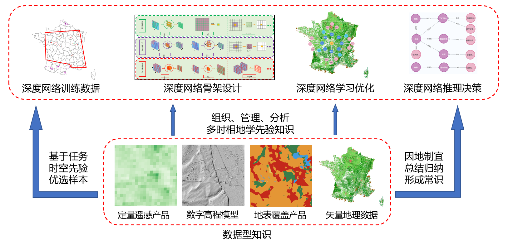

# 时空知识图谱嵌入深度网络

## 主要功能

1. 构建2020年法国Globeland30地表覆盖产品知识图谱

kg_creater/GLC_loader.py

2. 生成影像对应的地表覆盖产品

kg_search/kg_searcher.py

3. 构建2022年法国OpenStreetMap土地利用数据知识图谱，生成影像对应的土地利用矢量及栅格数据，可用于修正深度网络预测结果

kg_creater/OSM_loader.py

4. 根据深度网络预测结果中推理单元的类别向量、邻接矩阵、邻接边长矩阵，计算出其满足的条件；将每个推理单元的类别及其满足的条件输入知识图谱进行知识推理，生成知识推理结果

kg_reasoning/reasoning.py

