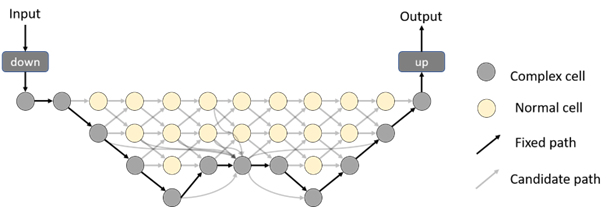

# 遥感影像网络架构搜索




## 搜索架构
1. 制作语义分割数据集

下载FU数据集（或其他数据集）后，制作相应的datalist文件

2. 根据需求修改config中obtain_search_args()的参数。

```python
# checking point
    parser.add_argument('--resume', type=str, default=None, help='put the path to resuming file if needed')
    parser.add_argument('--checkname', type=str, default='search/first', help='set the checkpoint name')
    parser.add_argument('--model_encode_path', type=str, default='./model/first_connect_4.npy')
    parser.add_argument('--search_stage', type=str, default='first', choices=['first', 'second', 'third', 'hrnet'], help='witch search stage')

    parser.add_argument('--batch-size', type=int, default=12, metavar='N', help='input batch size for training (default: auto)')
    parser.add_argument('--dataset', type=str, default='uadataset', choices=['uadataset', 'cityscapes'], help='dataset name (default: pascal)')
    parser.add_argument('--data_path', type=str, default='/media/dell/DATA/wy/data', help='dataset root path')

    parser.add_argument('--workers', type=int, default=0,metavar='N', help='dataloader threads')
    parser.add_argument('--crop_size', type=int, default=512, help='crop image size')
    parser.add_argument('--resize', type=int, default=512, help='resize image size')

    parser.add_argument('--nclass', type=int, default=12, help='number of class')

    # training hyper params
    parser.add_argument('--epochs', type=int, default=60, metavar='N', help='number of epochs to train')
    parser.add_argument('--alpha_epochs', type=int, default=20, metavar='N', help='number of alpha epochs to train')
    parser.add_argument('--start_epoch', type=int, default=0, metavar='N', help='start epochs (default:0)')
    parser.add_argument('--eval_start', type=int, default=20, metavar='N', help='start eval epochs (default:0)')
    parser.add_argument('--filter_multiplier', type=int, default=8)
    parser.add_argument('--block_multiplier', type=int, default=5)
    parser.add_argument('--step', type=int, default=5)
    parser.add_argument('--alpha_epoch', type=int, default=20, metavar='N', help='epoch to start training alphas')

    # optimizer params
    parser.add_argument('--lr', type=float, default=0.025, metavar='LR',help='learning rate (default: auto)')
    parser.add_argument('--min_lr', type=float, default=0.001)
    parser.add_argument('--arch-lr', type=float, default=3e-3, metavar='LR', help='learning rate for alpha and beta in architect searching process')

    parser.add_argument('--lr-scheduler', type=str, default='cos', choices=['poly', 'step', 'cos'], help='lr scheduler mode')
    parser.add_argument('--momentum', type=float, default=0.9, metavar='M', help='momentum (default: 0.9)')
    parser.add_argument('--weight-decay', type=float, default=3e-4, metavar='M', help='w-decay (default: 5e-4)')
    parser.add_argument('--arch-weight-decay', type=float, default=1e-3, metavar='M', help='w-decay (default: 5e-4)')
    parser.add_argument('--nesterov', action='store_true', default=False, help='whether use nesterov (default: False)')

    # cuda, seed and logging
    parser.add_argument('--gpu-ids', type=str, default='0',help='use which gpu to train, must be a comma-separated list of integers only (default=0)')
    parser.add_argument('--seed', type=int, default=1, metavar='S', help='random seed (default: 1)')

```
3. 分别运行三次搜索过程

```bash
python search.py --first
python search.py --second
python search.py --third
```
## 再训练搜索得到的网络
1. 准备数据集（同上）
2. 根据需求修改config中obtain_retrain_args()的参数。
3. 运行再训练代码
```bash
python retrain.py
```