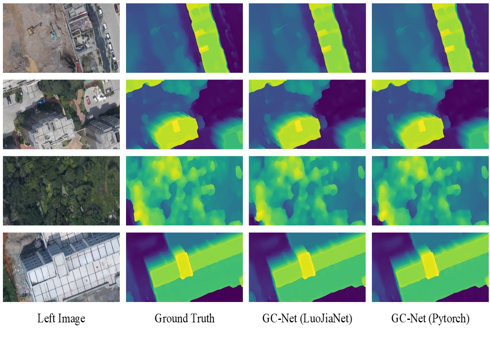

# 遥感影像密集匹配与三维重建
## 双目立体匹配网络 GC-Net
参考：Alex Kendall, Hayk Martirosyan, Saumitro Dasgupta, Peter Henry, Ryan Kennedy, Abraham Bachrach, Adam Bry; Proceedings of the IEEE International Conference on Computer Vision (ICCV), 2017, pp. 66-75


### 数据准备
下载WHU—MVS数据集
http://gpcv.whu.edu.cn/data/WHU_MVS_Stereo_dataset.html

### 训练
在LuoJiaNET环境下， 执行以下命令，进行网络的训练：
```
sh train.sh
```
或
```
python train.py --train_list="list/whu_training.txt" --valid_list="list/whu_validation.txt" --crop_h=256 --crop_w=512 --max_disp=160 --batch=1 --epochs=30 --dataset_type="whu" --lr=0.001 --amp_level='O0'
```
### 预测
在LuoJiaNET环境下， 执行以下命令，进行网络的预测：
```
sh predict.sh
```
或
```
python predict.py --predict_list="list/whu_validation.txt" --crop_h=384 --crop_w=768 --max_disp=160 --dataset_type="whu" --model_path="checkpoint/checkpoint_gcnet_whu-20_8316.ckpt" --save_path="/mnt/gj/stereo/WHU_epipolar/luojia_result"
```
### 评估
在LuoJiaNET环境下， 执行以下命令，进行网络的评估：
```
sh eval.sh
```
或
```
python eval.py --eval_list="list/whu_validation.txt" --crop_h=384 --crop_w=768 --max_disp=160 --dataset_type="whu" --model_path="checkpoint/checkpoint_gcnet_whu-20_8316.ckpt"
```

### 评估结果
定量评估结果如下表：

| MAE(Pixel) | <1(%) | <2(%) | <3(%) |
|------------|-------|-------|-------|
| 0.176      | 98.12 | 98.98 | 99.31 |

可视化结果如下图：

