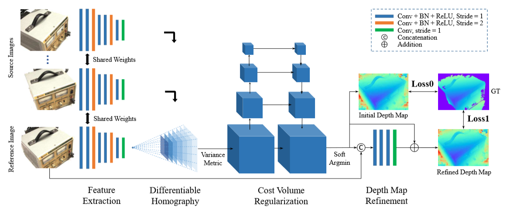
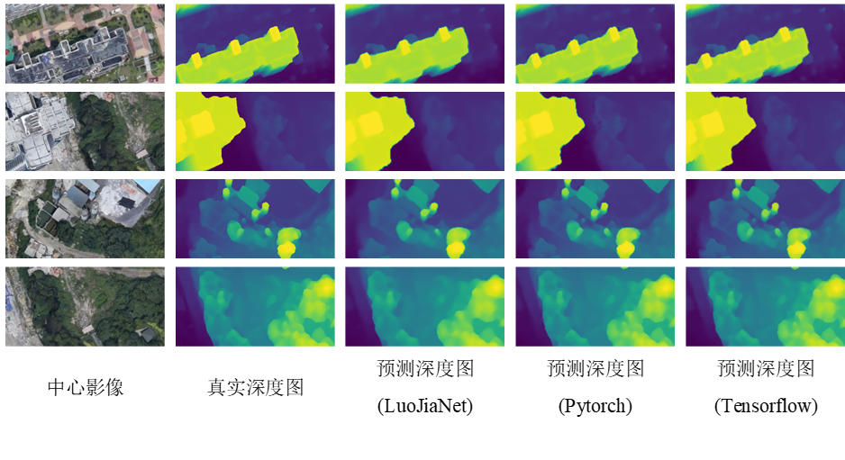

# 遥感影像密集匹配与三维重建
## 多视密集匹配网络 MVS-Net
参考：Yao Y, Luo Z, Li S, et al. Mvsnet: Depth inference for unstructured multi-view stereo[C]//Proceedings of the European Conference on Computer Vision (ECCV). 2018: 767-783.



### 数据准备
下载WHU—MVS数据集

### 训练
在LuoJiaNET环境下， 执行以下命令，进行网络的训练：
```
sh train.sh
```
或
```
python train.py --data_root='/mnt/gj/stereo' --view_num=3 --ndepths=200 --max_w=768 --max_h=384 --epochs=50 --lr=0.001
```
### 预测
在LuoJiaNET环境下， 执行以下命令，进行网络的预测：
```
sh predict.sh
```
或
```
python predict.py --data_root='/mnt/gj/stereo' --loadckpt='./checkpoint_mvsnet/checkpoint_mvsnet_whu-30_3600.ckpt' --view_num=3 --ndepths=200 --output="result"
```
### 评估
在LuoJiaNET环境下， 执行以下命令，进行网络的评估：
```
sh eval.sh
```
或
```
python eval.py --data_root='/mnt/gj/stereo' --loadckpt='./checkpoint_mvsnet/checkpoint_mvsnet_whu-30_3600.ckpt' --view_num=3 --ndepths=200
```

### 评估结果
定量评估结果如下表：

| MAE(m) | <0.1m(%) | <0.3m(%) | <0.6m(%) |
|--------|----------|----------|----------|
| 0.256  | 46.19    | 82.76    | 92.52    |

可视化结果如下图：

