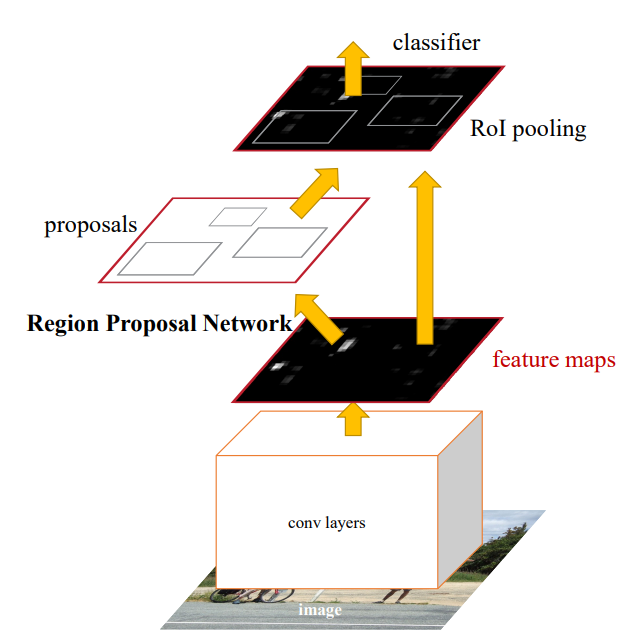
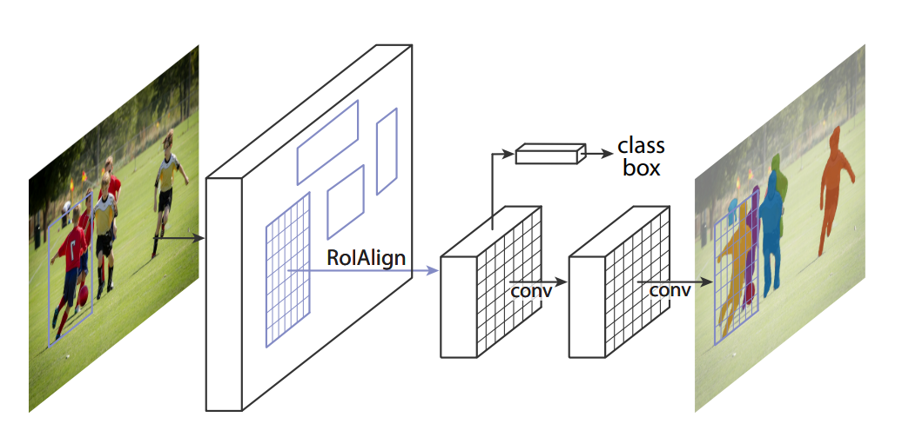

# 遥感影像目标检测网络
> 目标检测是计算机视觉领域中的基础任务之一，其目的是对输入图像中物体的类别和位置同时进行预测。由于图像中存在的物体数量、大小、分布情况不同，目标检测任务仍然是研究学者关注的焦点领域之一。在遥感影像的目标检测中，尤为突出的问题主要包括待检测目标尺度小、目标密集程度大、细粒度检测等，本项目基于`LuoJiaNET`框架实现了经典目标检测网络 Faster-RCNN 以及实例分割网络 Mask-RCNN。
>
> 项目代码参考：
>
> - https://gitee.com/mindspore/models/tree/master/official/cv/faster_rcnn
> - https://gitee.com/mindspore/models/tree/master/official/cv/maskrcnn


### 目标检测网络简介

- **Faster-RCNN** 是Kaiming He等人在2016年提出的端到端的两阶段目标检测算法，也是目前落地最成功的深度学习模型之一，是目标检测领域最经典的模型之一。Faster-RCNN将目标检测任务分成了两个阶段，首先第一阶段，利用深度网络找出图像中共可能存在物体的区域，产生Region Proposal；第二阶段，对Region Proposal内的物体进行分类，并对第一阶段检测的anchor框进行回归。网络损失主要有三部分构成，包括RPN分类、回归损失，以及Bounding Box Head和Classification Head的损失。模型如下图所示：

  

  > 论文：《Faster R-CNN: Towards Real-Time Object Detection with Region Proposal Networks》
  > 链接：https://arxiv.org/abs/1506.01497

- **Mask-RCNN** 是Kaiming He等人在2018年提出的端到端的两阶段实例分割算法，该方法是在Faster-RCNN的基础上添加了一个预测分割mask的分支，实现了对图像中检测到的目标实例进行分割的效果。在此基础上，基于该模型可以进一步实现姿态检测等任务。同时，实验证明，该方法通过利用多任务学习的思想，有助于提升目标检测的效果。该网络模型的主要结构如下图所示：

  

  > 论文：《Mask R-CNN》
  >
  > 链接：https://arxiv.org/pdf/1703.06870.pdf


### 一、环境配置 

1. 本项目使用的实验环境参考：`requirements.txt`；

   ```shell
   # other packages need to install
   pip install attrdict
   pip install pycocotools
   pip install opencv-python
   conda install pyyaml
   conda install shapely 
   
   # mmcv 用于图像的预处理和后处理
   pip install mmcv-full -f https://download.openmmlab.com/mmcv/dist/cu111/torch1.10.0/index.html

### 二. 数据集

1. 将数据集组织成以下文件结构，并将标注转化成COCO标注格式（具体可参考[链接](./examples/coco_example.json)）为例，并根据实际需要在`./config/faster_rcnn_r152_fpn.yaml`文件中修改路径配置：

   ```txt
   └── datasets  # 数据集根目录
       ├── train  # 训练集
       │    ├── 000000000001.png
       │    ├── 000000000002.png
       │    ├── ...
       ├── val  # 测试集
       │    ├── 000000000001.png
       │    ├── 000000000002.png
       │    ├── ...
       ├── train.json  # 如果使用maskrcnn，则需要包含mask的多边形标注信息
       ├── val.json  # 如果使用maskrcnn，则需要包含mask的多边形标注信息
   ```

### 三、预训练模型

1. 预训练模型：可以从[mindspore hub](https://www.mindspore.cn/hub/docs/zh-CN/master/loading_model_from_hub.html)上进行下载或者使用下面的百度云链接，这里使用的是`imagenet2012`上预训练的`resnet152`模型；将预训练模型下载后，放到`./pretrained_models/`目录下；

   > 链接：https://pan.baidu.com/s/1YbEZPE3noWbclJznSqp4CQ   提取码：2022

2. 这里提供了我们在[慧眼“天智杯”人工智能挑战赛](https://www.rsaicp.com/)可见光飞机目标检测数据集上训练好的`faster-rcnn`模型以及`mask-rcnn`模型：

   |   模型名称   |                          链接                           | 提取码 |
   | :----------: | :-----------------------------------------------------: | :----: |
   | Faster R-CNN | [link](https://pan.baidu.com/s/1XxGlwyOd4z1MJehJ0vVLvg) |  2022  |
   |  Mask R-CNN  | [link](https://pan.baidu.com/s/1-rU7nQ2I-dxsCtgEEe8ZAA) |  2022  |

### 四、模型训练

1. 下载数据集，并将数据集整理成规定格式；

   > 为了方便测试，这里准备了一个仅包含10张图像的mini_dataset，见`./examples/mini_dataset`；

2. 根据需求修改`config`文件夹下的配置文件，以`faster_rcnn_r152_fpn.yaml`为例（下面仅列出了主要的参数以及含义）：

   ```yaml
   # ==============================================================================
   # Training options
   device_target: GPU # Ascend  # 目标设备
   dataset: "coco"  # 数据集类型
   device_id: 2  # 显卡ID
   device_num: 1  # 显卡数量
   rank_id: 0 
   run_distribute: False  # 是否采用分布式训练
   
   pre_trained: './pretrained_models/resnet152.ckpt'  # 预训练模型路径
   coco_root: "./examples/mini_dataset/"   # 数据集路径，建议使用绝对路径
   train_data_type: "train"  # 训练数据集文件名
   val_data_type: "val"  # 验证集文件名
   instance_set: "{}.json"  # 与文件名同名的json文件，包含对应的数据集注释
   coco_classes: ['background', 'ap',]  # 检测类别名称，注意需要添加background类别
   num_classes: 2  # 类别数目
   
   max_instance_count: 128  # 图像中最大实例数，需要根据数据集实际情况设置
   num_gts: 128  # 图像中最大的gt数量，需要设置为与实例数量相等
   
   # enable mask branch
   mask_on: False  # 是否使用mask分支，false为仅使用bbox以及cls分支；若使用maskrcnn，则该参数需要设置为True
   
   # LR
   base_lr: 0.02  # 基础学习率
   warmup_step: 500  # warmup次数，建议可以设置大一些
   warmup_ratio: 0.0625  # warmup学习率比例，建议设置小一些
   
   # train
   batch_size: 2  # 批大小
   loss_scale: 256  # 梯度值放大倍数，建议faster-rcnn设置256，maskrcnn设置为1
   momentum: 0.91  # 动量
   weight_decay: 0.0001 # 权重衰减
   epoch_size: 50  # 迭代轮次
   save_checkpoint: True  # 是否存储训练参数
   save_checkpoint_epochs: 5  # 每隔多少个epoch存储模型
   keep_checkpoint_max: 7  # 存储模型个数上限
   save_checkpoint_path: "./output_dir/faster_rcnn_multi"  # 模型参数储存路径
   ```

3. 设置完毕后，命令行运行下面的命令进行训练：

   ```shell
   # 单卡训练
   # 是否并行：run_distribute: False   显卡ID：device_id: “0”    显卡数量：device_num: 1
   python train.py --config_path=./configs/faster_rcnn_r152_fpn.yaml  # for faster-rcnn
   python train.py --config_path=./configs/mask_rcnn_r152_fpn.yaml  # for mask-rcnn
   
   # 多卡训练，需要在config文件中设置相应的参数, 以两卡为例
   # 是否并行：run_distribute: True    显卡ID：device_id: "0,1"    显卡数量：device_num: 2
   mpirun -n 2 python train.py --config_path=./configs/faster_rcnn_r152_fpn.yaml # for faster-rcnn
   mpirun -n 2 python train.py --config_path=./configs/mask_rcnn_r152_fpn.yaml  # for mask-rcnn

5. 训练好的模型会根据`config`中的参数保存在配置文件中`save_checkpoint_path`参数相应的目录下；损失函数记录在`loss.log`文件中；

### 五、模型性能评价

1. 选择合适的模型参数文件，运行`eval.py`进行模型性能评估，测试参数需要在`example_config.yaml`文件中进行配置，或者使用命令行参数进行指定；（目前仅支持`coco`  json格式的标注文件）

   ```shell
   # ==============================================================================
   ### 配置config参数
   # Eval Options
   eval_save_dir: './output_dir/eval_result/'  # 评价结果存储路径
   ann_file: "./example/mini_dataset/train.json"  # 待评价数据标注json文件
   eval_checkpoint_path: './pretrained_models/faster_rcnn-30_2253.ckpt'  # 待评价模型参数
   # ==============================================================================
   ### 或者，可以使用命令行参数调用
    python eval.py 
    --config_path path/to/config \  # 配置文件路径
    --enable_eval \  # 设置为评价模式，仅在此模式下可以使用命令行参数传入
    --eval_dataset=./examples/mini_dataset \  # 数据集路径，对应coco_root
    --annotation=./examples/mini_dataset/train.json \  # 标注文件路径，对应val_anno_path
    --result_save_path=./output_dir/eval_result/ \  # 输出结果存储路径
    --checkpoint_path=./pretrained_models/faster_rcnn-30_2253.ckpt  # 模型参数路径

### 六、模型推理

1. 选择合适的模型参数文件，运行`inference.py`进行模型推理，测试参数需要在`example_config.yaml`文件中进行配置，或者使用命令行参数进行指定；

   > 样例图片可从下面链接中下载，放在`./examples/inference_images/`目录下。、
   >
   > 链接：https://pan.baidu.com/s/1FWSm9Sv70NzOC190keiWmg  提取码：2022 

   ```shell
   # ==============================================================================
   ### 配置config参数
   # Inference Options
   inference_save_dir: './output_dir/inference/'  # 推理结果存储路径
   inference_img_dir: './examples/inference_images/'  # 待推理图像文件夹路径
   inference_checkpoint_path: "./pretrained_models/faster_rcnn-30_2253.ckpt"  # 参数路径
   inference_img_width: 4096  # 待推理图像尺寸，默认4096并使用滑窗裁剪为1024进行检测
   inference_img_height: 4096
   # ==============================================================================
   ### 或者，可以使用命令行参数调用
   python inference_fasterrcnn.py  
   --config_path path/to/config # 配置文件路径 
   --enable_infer \  # 设置为推理模式，仅在此模式下可以使用命令行参数传入
   --infer_img_dir=./examples/inference_images/ \  # 待推理图像文件夹，图像格式*png
   --infer_save_dir=./output_dir/inference_results/ \  # 推理结果存储文件夹
   --infer_checkpoint_path=./pretrained_models/faster_rcnn-30_2253.ckpt\  # 模型参数路径 
   --infer_img_width=4096 \  # 待推理图像宽度
   --infer_img_height=4096  # 待推理图像高度
   ```

2. 模型推理结果保存在`--infer_save_dir`路径下（或`inference_save_dir`指定的路径下）， 结果包括推理可视化的目标检测结果图，以及检测结果的`result.txt`文件

   - 效果图：本项目使用Faster-RCNN实现了水平框目标检测（水平目标框用红色标出），并利用Mask-RCNN实现了对旋转目标的检测（水平目标框用红色标出，旋转目标框使用mask的最小外接矩形用绿色框标出）：

     |            Faster-RCNN             |            Mask-RCNN            |
     | :--------------------------------: | :-----------------------------: |
     |  |  |

   - 结果保存的`txt`文件格式如下：
   
     ```txt
     # txt format: image_name, confidence, [x_min, y_min, x_max, y_max] (class_id)
     253.png 1.0 1474 2082 1500 2112 
     253.png 1.0 1441 2090 1467 2119 
     253.png 1.0 1474 2082 1500 2112 ....
   

