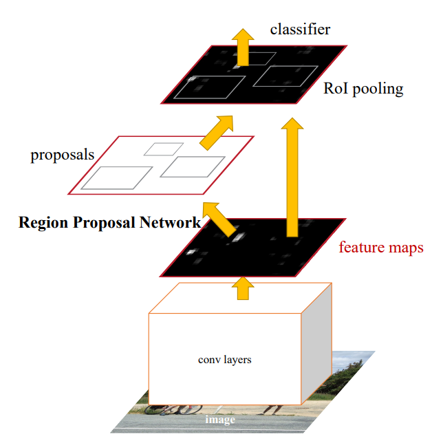
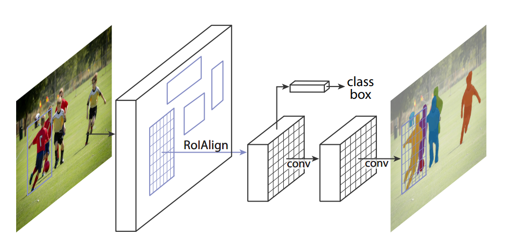
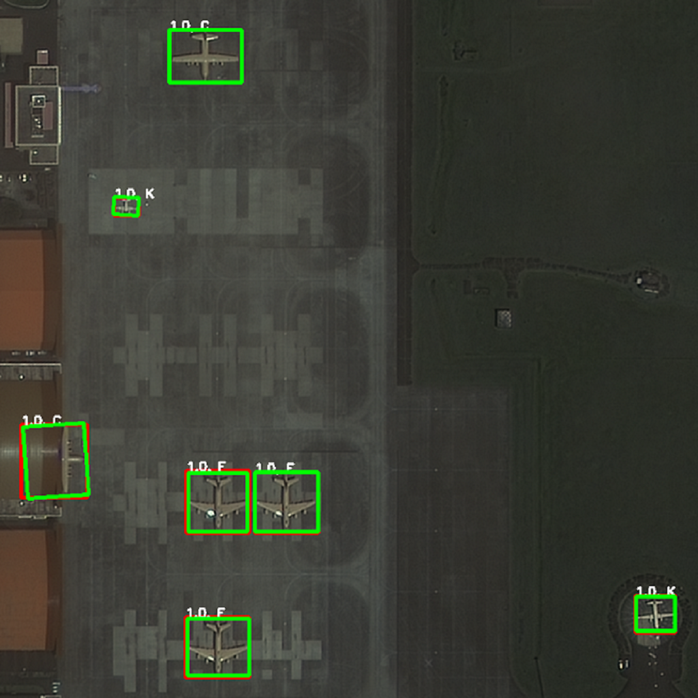

# 遥感影像目标检测网络
> ​    目标检测是计算机视觉领域中的基础任务之一，其目的是对输入图像中物体的类别和位置同时进行预测。由于图像中存在的物体数量、大小、分布情况不同，目标检测任务仍然是研究学者关注的焦点领域之一。在遥感影像的目标检测中，尤为突出的问题主要包括待检测目标尺度小、目标密集程度大、细粒度检测等，本项目基于`LuoJiaNET`框架实现了经典目标检测网络 Faster-RCNN 、实例分割网络 Mask-RCNN以及细粒度分类模型。
>
> 项目代码参考：
>
> - https://gitee.com/mindspore/models/tree/master/official/cv/faster_rcnn
> - https://gitee.com/mindspore/models/tree/master/official/cv/maskrcnn
> - https://github.com/KevinMusgrave/pytorch-metric-learning/


### 目标检测网络简介

- **Faster-RCNN** 是Kaiming He等人在2016年提出的端到端的两阶段目标检测算法，也是目前落地最成功的深度学习模型之一，是目标检测领域最经典的模型之一。Faster-RCNN将目标检测任务分成了两个阶段，首先第一阶段，利用深度网络找出图像中共可能存在物体的区域，产生Region Proposal；第二阶段，对Region Proposal内的物体进行分类，并对第一阶段检测的anchor框进行回归。网络损失主要有三部分构成，包括RPN分类、回归损失，以及Bounding Box Head和Classification Head的损失。模型如下图所示：

  

  > 论文：《Faster R-CNN: Towards Real-Time Object Detection with Region Proposal Networks》
  > 链接：https://arxiv.org/abs/1506.01497

- **Mask-RCNN** 是Kaiming He等人在2018年提出的端到端的两阶段实例分割算法，该方法是在Faster-RCNN的基础上添加了一个预测分割mask的分支，实现了对图像中检测到的目标实例进行分割的效果。在此基础上，基于该模型可以进一步实现姿态检测等任务。同时，实验证明，该方法通过利用多任务学习的思想，有助于提升目标检测的效果。该网络模型的主要结构如下图所示：

  

  > 论文：《Mask R-CNN》
  >
  > 链接：https://arxiv.org/pdf/1703.06870.pdf
  
- **度量学习**从数据中学习如何度量数据对象间距，使网络学习如何将数据映射到类内距离小而类间距离大的特征空间，从而解决细粒度分类任务中类间特征差异小的问题；推理时通常使用K最近邻算法(`KNN`)在学习到的特征空间中确定待分类目标的类别。本项目在Mask-RCNN网络的基础上，进一步使用基于度量学习的细粒度分类方法，实现了遥感影像目标细粒度分类。
  
  >论文：《A Metric Learning Reality Check》
  >
  >链接：https://arxiv.org/pdf/2003.08505.pdf
  
  

### 一、环境配置 

1. 本项目使用的实验环境参考：python版本须为3.8版本，`requirements.txt`；

   ```shell
   # other packages need to install
   pip install attrdict
   pip install pycocotools
   pip install opencv-python
   pip install faiss-gpu  # for metric-learning
   
   conda install pyyaml
   conda install shapely
   
   # mmcv 用于图像的预处理和后处理
   pip install mmcv-full -f https://download.openmmlab.com/mmcv/dist/cu111/torch1.10.0/index.html

### 二、数据集

1. 将目标检测数据集组织成以下文件结构，并将标注转化成COCO标注格式（具体可参考[链接](./examples/coco_example.json)）为例，并根据实际需要在`./config/faster_rcnn_r152_fpn.yaml`文件中修改路径配置：

   ```txt
   └── datasets  # 数据集根目录
       ├── train  # 训练集
       │    ├── 000000000001.png
       │    ├── 000000000002.png
       │    ├── ...
       ├── val  # 测试集
       │    ├── 000000000001.png
       │    ├── 000000000002.png
       │    ├── ...
       ├── train.json  # 如果使用maskrcnn，则需要包含mask的多边形标注信息
       ├── val.json  # 如果使用maskrcnn，则需要包含mask的多边形标注信息
   ```
   
1. 将细粒度分类数据集组织成以下文件结构，并根据实际需要在`./config/ml_standard.yaml`文件中修改路径配置：（注意该数据集仅用于训练细粒度分类模型，可以通过将目标检测数据集中的目标裁剪下来制作成需要的格式，具体可以参考[链接](./examples/ml_example.txt)，这里提供了我们在天智杯数据集上制作的细粒度分类的数据集，见百度云链接，将数据集下载后放到`./datasets`目录下，并按照下面格式进行组织）

   > 链接：https://pan.baidu.com/s/1Col6bJ2YK90ty5qxtFRaDQ  提取码：2022
   
   ```txt
   └── datasets  # 数据集根目录
       ├── ml_train  # 训练集
       │    ├── 000000000001.png
       │    ├── 000000000002.png
       │    ├── ...
       ├── ml_val  # 测试集
       │    ├── 000000000001.png
       │    ├── 000000000002.png
       │    ├── ...
       ├── ml_train.txt  # 训练集标签文件
       ├── ml_val.txt  # 测试集标签文件
   
   
   # 细粒度分类的标签文件格式如下：  
   # txt format: image_name, class_id
   000000000001.png   1
   000000000002.png   1
   000000000003.png   3
   ```
   


### 三、预训练模型

1. 预训练模型：可以从[mindspore hub](https://www.mindspore.cn/hub/docs/zh-CN/master/loading_model_from_hub.html)上进行下载或者使用下面的百度云链接，这里使用的是`imagenet2012`上预训练的`resnet152`模型；将预训练模型下载后，放到`./pretrained_models/`目录下；

   > 链接：https://pan.baidu.com/s/1YbEZPE3noWbclJznSqp4CQ   提取码：2022

2. 这里提供了我们在[慧眼“天智杯”人工智能挑战赛](https://www.rsaicp.com/)可见光飞机目标检测数据集上训练好的`faster-rcnn`模型、`mask-rcnn`模型、细粒度分类模型，放在：

   |       名称       |                          链接                           | 提取码 |
   | :--------------: | :-----------------------------------------------------: | :----: |
   | Faster R-CNN模型 | [link](https://pan.baidu.com/s/1XxGlwyOd4z1MJehJ0vVLvg) |  2022  |
   |  Mask R-CNN模型  | [link](https://pan.baidu.com/s/1-rU7nQ2I-dxsCtgEEe8ZAA) |  2022  |
   |  细粒度分类模型  | [link](https://pan.baidu.com/s/1hYfWcSleeKqE4GTV0PU-Zg) |  2022  |

### 四、配置文件细节

1. 目标检测配置文件，以`mask_rcnn_r152_fpn_ml.yaml`为例（下面仅列出了主要的参数以及含义）

   ```yaml
   # ==============================================================================
   # Training options
   device_target: GPU # Ascend  # 目标设备
   dataset: "coco"  # 数据集类型
   device_id: 0  # 显卡ID
   device_num: 1  # 显卡数量
   rank_id: 0 
   run_distribute: False  # 是否采用分布式训练
   
   pre_trained: './pretrained_models/resnet152.ckpt'  # 预训练模型路径
   coco_root: "/luojiaNet/model_zoo/rs_object_detection/examples/mini_dataset/"   # 数据集路径，需要使用绝对路径
   train_data_type: "train"  # 训练数据集文件名
   val_data_type: "val"  # 验证集文件名
   instance_set: "{}.json"  # 与文件名同名的json文件，包含对应的数据集注释
   coco_classes: ['background', 'ap',]  # 检测类别名称，注意需要添加background类别
   num_classes: 2  # 类别数目
   
   max_instance_count: 128  # 图像中最大实例数，需要根据数据集实际情况设置
   num_gts: 128  # 图像中最大的gt数量，需要设置为与实例数量相等
   
   # enable mask branch
   mask_on: False  # 是否使用mask分支，false为仅使用bbox以及cls分支；若使用maskrcnn，则该参数需要设置为True
   
   # LR
   base_lr: 0.02  # 基础学习率
   warmup_step: 500  # warmup次数，建议可以设置大一些
   warmup_ratio: 0.0625  # warmup学习率比例，建议设置小一些
   
   # train
   batch_size: 2  # 批大小
   loss_scale: 256  # 梯度值放大倍数，建议faster-rcnn设置256，maskrcnn设置为1
   momentum: 0.91  # 动量
   weight_decay: 0.0001 # 权重衰减
   epoch_size: 50  # 迭代轮次
   save_checkpoint: True  # 是否存储训练参数
   save_checkpoint_epochs: 5  # 每隔多少个epoch存储模型
   keep_checkpoint_max: 7  # 存储模型个数上限
   save_checkpoint_path: "./output_dir/faster_rcnn_multi"  # 模型参数储存路径
   
   # ==============================================================================
   # eval options
   eval_save_dir: './output_dir/eval_result/'  # 评价结果存储路径
   ann_file: "./examples/mini_dataset/train.json" # 待评价数据标注json文件
   eval_checkpoint_path: './pretrained_models/mask_rcnn-30_2253.ckpt' # 待评价模型参数
   
   
   # ==============================================================================
   # Inference Options
   inference_save_dir: './output_dir/inference/'  # 推理结果存储路径
   inference_img_dir: './examples/inference_images/'  # 待推理图像文件夹路径
   inference_checkpoint_path: "./pretrained_models/faster_rcnn-30_2253.ckpt"  # 模型参数路径
   
   # ML inference
   ml_cfg_path: './configs/ml_standard.yaml' # 细粒度分类配置文件路径，做细粒度分类模型推理时使用
   ml_checkpoint_path: './pretrained_models/gt_det_12-10_5.ckpt' # 细粒度分类模型路径，做细粒度分类推理时使用

2. 细粒度分类模型训练及测试配置文件， 以`ml_standard.yaml`为例（下面仅列出了主要的参数以及含义）

   ```yaml
   # ==============================================================================
   Device_id: 0 # 显卡ID
   
   DATA:
       train_root: /luojiaNet/model_zoo/rs_object_detection/examples/ml_mini_dataset/train/ # 训练集图像路径，需要绝对地址
       train_list: train.txt # 训练集标签文件名
       test_root: /luojiaNet/model_zoo/rs_object_detection/examples/ml_mini_dataset/train/ # 测试集图像路径，需要绝对地址
       test_list: mini_train.txt # 测试集标签文件名
   
       re_size: [128, 128] # 图像缩放的尺寸
       cls_num: 12 # 类别数目
   
       AUG:
           resize_h: 128 # 训练时图像经过缩放后的高度
           resize_w: 128 # 训练时图像经过缩放后的宽度
   
   MODEL:
       backbone: "resnet_152" # 骨干网络类型
       load_model_path: ./pretrained_models/resnet152.ckpt # 骨干网络预加载路径
   
   TRAIN:
       epoch: 300 # 迭代轮次
       lr: 0.0001 # 基础学习率
       batch_size: 128 # 批大小
       warmup_step: 0 # warmup次数
       warmup_ratio: 0.0625 # warmup学习率比例
   
   TEST:
       rank_k: 3 # K最近邻算法的K值
   
   # ==============================================================================
   save_checkpoint_epochs: 10 # 每隔多少个epoch存储模型
   keep_checkpoint_max: 25 # 存储模型个数上限
   save_checkpoint_path: './output_dir/ml_mini_dataset' # 模型参数储存路径
   ```


### 五、模型训练

1. 下载数据集，并将数据集整理成第二部分规定的格式；

   > 为了方便测试，这里准备了一个仅包含10张图像的mini_dataset用于训练目标检测网络，见`./examples/mini_dataset`；
   >
   > 以及一个包含16张细粒度图像的ml_mini_dataset用于训练细粒度分类模型，见`./examples/ml_mini_dataset`；

2. 若要训练目标检测模型，则根据需求修改`config`文件夹下的目标检测配置文件（`mask_rcnn_r152_fpn.yaml`或`faster_rcnn_r152_fpn.yaml`）；

   若要训练细粒度分类模型，则根据需求修改`config`文件夹下的细粒度模型配置文件(`ml_standard.yaml`)；
   
3. 设置完毕后，命令行运行下面的命令进行训练：

   ```shell
   # 单卡训练
   # 是否并行：run_distribute: False   显卡ID：device_id: “0”    显卡数量：device_num: 1
   python train.py --config_path=./configs/faster_rcnn_r152_fpn.yaml  # for faster-rcnn
   python train.py --config_path=./configs/mask_rcnn_r152_fpn.yaml  # for mask-rcnn
   python ml_train.py --config_path=./configs/ml_standard.yaml  # for fine-grain
   
   # 多卡训练，需要在config文件中设置相应的参数, 以两卡为例
   # 是否并行：run_distribute: True    显卡ID：device_id: "0,1"    显卡数量：device_num: 2
   mpirun -n 2 python train.py --config_path=./configs/faster_rcnn_r152_fpn.yaml # for faster-rcnn
   mpirun -n 2 python train.py --config_path=./configs/mask_rcnn_r152_fpn.yaml  # for mask-rcnn

5. 训练好的模型会根据`config`中的参数保存在配置文件中`save_checkpoint_path`参数相应的目录下；损失函数记录在`loss.log`文件中；

### 六、模型性能评价

1. 目标检测模型性能评价：选择合适的模型参数文件，运行`eval.py`进行目标检测模型性能评估，测试参数需要在对应的`yaml`文件中进行配置，或者使用命令行参数进行指定；（目前仅支持`coco`  json格式的标注文件）

   ```yaml
   # ==============================================================================
   ### 配置config参数
   # Eval Options
   eval_save_dir: './output_dir/eval_result/'  # 评价结果存储路径
   ann_file: "./example/mini_dataset/train.json"  # 待评价数据标注json文件
   eval_checkpoint_path: './pretrained_models/faster_rcnn-30_2253.ckpt'  # 待评价模型参数
   # ==============================================================================
   ### 或者，可以使用命令行参数调用
    python eval.py 
    --config_path=./configs/faster_rcnn_r152_fpn.yaml \  # 配置文件路径
    --enable_eval \  # 设置为评价模式，仅在此模式下可以使用命令行参数传入
    --eval_dataset=./examples/mini_dataset \  # 数据集路径，对应coco_root
    --annotation=./examples/mini_dataset/train.json \  # 标注文件路径，对应val_anno_path
    --result_save_path=./output_dir/eval_result/ \  # 输出结果存储路径
    --checkpoint_path=./pretrained_models/faster_rcnn-30_2253.ckpt  # 模型参数路径
   ```
   
	在天智杯--可见光图像飞机识别验证集上进行评估(仅检测飞机，不做细粒度分类)，与`pytorch`（`mmdetec`）对比结果如下：
	
	| (mF1) |Pytorch      |LuoJiaNET       |
	| :---------: | :--: | :--: |
	| Faster-RCNN | 90.15 | **91.75** |
	| Mask-RCNN   |  89.90  |   **91.53**   |
	
2. 细粒度分类模型性能评价：选择合适的模型参数（`.ckpt`）文件，运行`ml_eval.py`进行目标检测模型性能评估，测试参数需要在对应的`ml_standard.yaml`文件中进行配置，然后使用命令行运行：

   ```shell
   # ==============================================================================
   # 修改配置文件对应位置：
   train_root: /luojiaNet/model_zoo/rs_object_detection/examples/ml_mini_dataset/train/ # 训练集图像路径，需要绝对地址
   train_list: train.txt # 训练集标签文件名
   test_root: /luojiaNet/model_zoo/rs_object_detection/examples/ml_mini_dataset/train/ # 测试集图像路径，需要绝对地址
   test_list: val.txt # 测试集标签文件名
   # ==============================================================================
   
   命令行运行：
   python ml_eval.py
	  --gpu_id=0 \  # gpu id
	 --config_path=./configs/ml_standard.yaml \  # 配置文件路径
	 --checkpoint_path=./output_dir/ml_mini_dataset/gt_det_12-10_5.ckpt  # 模型参数路径
	```
	
	在天智杯--可见光图像飞机识别验证集上的评估结果(基于Mask-RCNN对飞机目标进行细粒度分类)：
	
	| Model |mF1       |
	| :---------: | :--: |
	| Mask-RCNN + 细粒度分类 | 85.88 |
	

### 七、模型推理

1. 目标检测模型推理：选择合适的模型参数文件，运行`inference_maskrcnn.py`或`inference_fasterrcnn.py`进行模型推理，测试参数需要在对应的`yaml`文件中进行配置，或者使用命令行参数进行指定；

   > 样例图片可从下面链接中下载，放在`./examples/inference_images/`目录下。、
   >
   > 链接：https://pan.baidu.com/s/1FWSm9Sv70NzOC190keiWmg  提取码：2022 

   ```shell
   # ==============================================================================
   ### 配置config参数
   # Inference Options
   inference_save_dir: './output_dir/inference/'  # 推理结果存储路径
   inference_img_dir: './examples/inference_images/'  # 待推理图像文件夹路径
   inference_checkpoint_path: "./pretrained_models/faster_rcnn-30_2253.ckpt"  # 参数路径
   # ==============================================================================
   ### 或者，可以使用命令行参数调用
   python inference_fasterrcnn.py  
   --config_path=./configs/faster_rcnn_r152_fpn.yaml # 配置文件路径 
   --enable_infer \  # 设置为推理模式，仅在此模式下可以使用命令行参数传入
   --infer_img_dir=./examples/inference_images/ \  # 待推理图像文件夹，图像格式*png
   --infer_save_dir=./output_dir/inference_results/ \  # 推理结果存储文件夹
   --infer_checkpoint_path=./pretrained_models/faster_rcnn-30_2253.ckpt\  # 模型参数路径 
   
   python inference_maskrcnn.py  
   --config_path=./configs/mask_rcnn_r152_fpn.yaml # 配置文件路径 
   --enable_infer \  # 设置为推理模式，仅在此模式下可以使用命令行参数传入
   --infer_img_dir=./examples/inference_images/ \  # 待推理图像文件夹，图像格式*png
   --infer_save_dir=./output_dir/inference_results/ \  # 推理结果存储文件夹
   --infer_checkpoint_path=./pretrained_models/mask_rcnn-30_2253.ckpt\  # 模型参数路径 
   ```
   
  2. 目标检测模型  +  细粒度模型推理(`注:细粒度分类采用KNN算法时需用到细粒度分类数据集中的训练集数据`)：选择合适的模型参数文件，运行`inference_fg_tianzhi.py`进行模型推理，测试参数需要在对应的`yaml`文件(`mask_rcnn_r152_fpn_ml.yaml`及 `ml_standard.yaml`)中进行配置，或者使用命令行参数进行指定；

     ```yaml
     # ==============================================================================
     ### 配置mask_rcnn_r152_fpn_ml.yaml的config参数
     # Inference Options
     inference_save_dir: './output_dir/inference/'  # 推理结果存储路径
     inference_img_dir: './examples/inference_images/'  # 待推理图像文件夹路径
     inference_checkpoint_path: "./pretrained_models/faster_rcnn-30_2253.ckpt"  # 参数路径
     # ML
     ml_cfg_path: './configs/ml_standard.yaml' # 细粒度分类配置文件路径，做细粒度分类模型推理时使用
     ml_checkpoint_path: './output_dir/ml_mini_dataset/gt_det_12-10_5.ckpt' # 细粒度分类模型路径，做细粒度分类推理时使用
     
     ### 配置ml_standard.yaml的config参数
     train_root: /luojiaNet/model_zoo/rs_object_detection/examples/ml_mini_dataset/train/ # 训练集图像路径，需要绝对地址
     train_list: train.txt # 训练集标签文件名
     # ==============================================================================
     ### 或者，可以使用命令行参数调用【需要修改ml_standard.yaml中的train_root 和 train_list】
     python inference_fg_tianzhi.py  
     --config_path=path/to/config # 配置文件路径 
     --enable_infer \  # 设置为推理模式，仅在此模式下可以使用命令行参数传入
     --infer_img_dir=./examples/inference_images/ \  # 待推理图像文件夹，图像格式*png
     --infer_save_dir=./output_dir/inference_results/ \  # 推理结果存储文件夹
     --infer_checkpoint_path=./pretrained_models/mask_rcnn-30_2253.ckpt\  # 模型参数路径 
     --ml_infer_cfg_path=./configs/ml_standard.yaml \ # 细粒度分类配置文件路径
     --ml_infer_checkpoint_path=./output_dir/ml_mini_dataset/gt_det_12-10_5.ckpt # 细粒度分类模型路径
     ```
     
3. 模型推理结果保存在`--infer_save_dir`路径下（或`inference_save_dir`指定的路径下）， 结果包括推理可视化的目标检测结果图，以及检测结果的文件夹。其中，Faster-RCNN输出保存水平框检测结果文件夹`hbb_result`，Mask-RCNN输出保存水平框检测结果的文件夹`hbb_result`以及旋转框检测结果的文件夹`obb_result`。

   - 效果图：本项目使用Faster-RCNN实现了水平框目标检测（水平目标框用红色标出），并利用Mask-RCNN实现了对旋转目标的检测（水平目标框用红色标出，旋转目标框用绿色框标出）以及根据Mask-RCNN的结果做进一步的细粒度分类：

     |                Faster-RCNN                 |                Mask-RCNN                |              细粒度分类               |
     | :----------------------------------------: | :-------------------------------------: | :-----------------------------------: |
     |  |  |  |

   - 结果保存的`txt`文件的文件名对应类别编号，文件内容格式如下：
   
     ```txt
     # HBB results
     # txt format: image_name, confidence, x_min, y_min, x_max, y_max  
     30.png 1.0 2213 3433 2259 3477 
     30.png 1.0 2302 3372 2347 3415 
     30.png 1.0 2277 3337 2321 3379 ....
     
     # OBB results
     # txt format: image_name, confidence, x_1, y_1, x_2, y_2， x_3, y_3, x_4, y_4 
     30.png 1.0 2213 3449 2244 3433 2259 3460 2228 3477 
     30.png 1.0 2301 3392 2331 3372 2347 3396 2317 3415 
     30.png 1.0 2277 3356 2305 3337 2320 3360 2292 3379 ....
     ```
     
   


