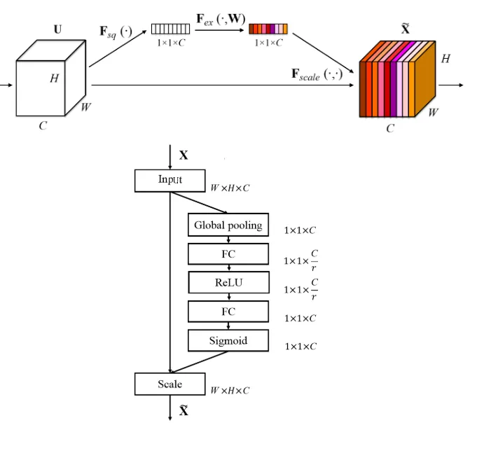

# 遥感影像场景训练SENet部分
论文：《Squeeze-and-Excitation Networks》
链接：[https://arxiv.org/abs/1709.01507v4](https://arxiv.org/abs/1709.01507v4)

&emsp;

>训练后模型下载：
>- [resnet50-se](https://whu.obs.cn-central-221.ovaijisuan.com/trained_model/resnet50-se.ckpt)
>- [resnet101-se](https://whu.obs.cn-central-221.ovaijisuan.com/trained_model/resnet101-se.ckpt)

1. 下载常用的遥感分类影像数据集，如WHU-RS19、UCMD以及NWPU DataSet等
2. 将数据集整理成如下格式：
```
.. code-block::
    .
    └── image_folder_dataset_directory
            ├── class1
            │    ├── 000000000001.jpg
            │    ├── 000000000002.jpg
            │    ├── ...
            ├── class2
            │    ├── 000000000001.jpg
            │    ├── 000000000002.jpg
            │    ├── ...
            ├── class3
            │    ├── 000000000001.jpg
            │    ├── 000000000002.jpg
            │    ├── ...
            ├── classN
            ├── ...
```
3. 根据需求修改config中的参数
```
    "device_target":"CPU",      #GPU或CPU
    "dataset_path": "WHU-RS19/",  #数据存放位置
    "save_checkpoint_path": "./checkpoint",  #保存的参数存放位置
    "resume":False,   #是否载入模型训练
    "class_num": 19,  #数据集中包含的种类
    "batch_size": 8,
    "loss_scale": 1024,
    "momentum": 0.9,
    "weight_decay": 1e-5,
    "epoch_size": 350, #训练次数
    "save_checkpoint": True, #是否保存模型
    "save_checkpoint_epochs": 1, #多少次迭代保存一次模型
    "keep_checkpoint_max": 5, #文件内保存模型的最多的个数，超过则删掉最原始的
    "opt": 'rmsprop', #优化器：rmsprop或sgd
    "opt_eps": 0.001, 
    "warmup_epochs": 50, #warmup训练策略
    "lr_decay_mode": "warmup", #学习率衰减方式：steps、poly、cosine以及warmup
    "use_label_smooth": True, 
    "label_smooth_factor": 0.1,
    "lr_init": 0.0001, #初始学习率
    "lr_max": 0.1, #最大学习率
    "lr_end": 0.00001 #最小学习率
```
4. 设置完毕后，在cmd下运行``python train.py``进行训练
5. 训练好的模型会根据config中的参数保存在相应的目录下，选择合适的模型，使用eval.py进行测试，在cmd下运行``python eval.py -d XXX -c XXX -t xxx``进行测试验证，也可用``python eval.py --dataset_path xxx --checkpoint_path xxx --device_target xxx``进行测试验证，输出为验证集的top-1和top-5精度指标   
```
-d --dataset_path 为验证集路径
-c --checkpoint_path为训练权重路径
-t --device_target为设备类型，包括CPU、GPU、Ascend
```
6. 利用预训练好的模型对单张影像进行预测，选择合适的模型，使用test.py进行预测，在cmd下运行``python test.py -i XXX -o XXX -c1 XXX -c2 XXX -t XXX``进行预测，输出该影像对应top-5的类别、对应ID以及概率,也可运行``python prediction.py --input_file ./input_image/bridge_1.jpg --output_folder ./output --checkpoint_path ./rs_scene_classification_ckp/xxx.ckpt –classes_file xxx.txt  --device_target xxx``进行预测
```
-i --input_file 为输入的单张影像路径，存储于input_image目录
-o --output_folder 为输出的结果所在文件夹，存储于output目录，输出结果文件名与输入影像相同，保存为json格式。例如输入影像名称为bridge_1.jpg，则输出名称为bridge_1.json
-c1 --checkpoint_path为训练权重路径，存储于rs_scene_classification_ckp目录
-c2 -- classes_file 为场景类别文件，xxx.txt文本文件中是所包含的类别名称
-t --device_target 为设备类型，包括CPU、GPU、Ascend
```
在output_folder目录先输出与输入图像名一致的json文件，内容如下：
```
{"title": "Top-1", "class_num": "  4", "class_name": "Bridge", "class_prob": "77.30%"},
{"title": "Top-2", "class_num": " 19", "class_name": "Pond", "class_prob": "19.64%"},
{"title": "Top-3", "class_num": " 16", "class_name": "Park", "class_prob": "2.45%"},
{"title": "Top-4", "class_num": " 23", "class_name": "River", "class_prob": "0.44%"},
{"title": "Top-5", "class_num": " 27", "class_name": "Stadium", "class_prob": "0.12%"}
```