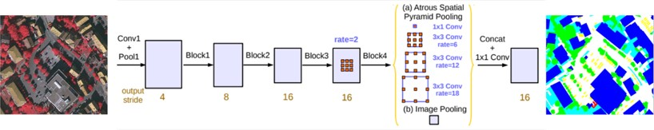

# 高分辨率遥感影像语义分割

模型包含常用的语义分割网络如下：

1.DeepLabv3

论文：《Rethinking Atrous Convolution for Semantic Image Segmentation》 

链接：https://arxiv.org/abs/1706.05587




1.下载ISPRS Vaihingen 数据集
https://www.isprs.org/education/benchmarks/UrbanSemLab/2d-sem-label-vaihingen.aspx

将数据集裁切以后整理成如下格式：

    |──data 			
         |──img_dir
         |    └──train
         |    |    |──000001.png
         |    |    |──000002.png
         |    |    |──000003.png
         |    |    └─ ...
         |    └──val
         |    |    |──000001.png
         |    |    |──000002.png
         |    |    |──000003.png
         |    |    └─ ...
         └──ann_dir
         |    └──train
         |    |    |──000001.png
         |    |    |──000002.png
         |    |    |──000003.png
         |    |    └─ ...
         |    └──val
         |    |    |──000001.png
         |    |    |──000002.png
         |    |    |──000003.png
         |    |    └─ ...
         |──train_image_id.txt#训练集图像的id
         |──val_image_id.txt#验证集图像的id
2.根据需求修改config中的参数

```python
param = {}
param['random_seed']=10000#随机种子
# dataset
param['data_dir'] = 'data/'#训练数据根目录
param['train_image_id_txt_path']=param['data_dir']+'/train_image_id.txt'#训练数据集ID
param['val_image_id_txt_path']=param['data_dir']+'/val_image_id.txt'#训练数据集ID
param['train_transform']='train_transform'#训练数据 transform
param['val_transform']='val_transform'#验证数据 transform
param['num_workers']=2#加载进程数
param['in_channels'] = 3#输入通道
param['model_network'] = "DeepLabV3"#模型类别

# Training parameters
param['epochs'] = 200#训练总轮数
param['train_batch_size'] = 8#训练batchsize
param['test_batch_size'] = 1#测试batchsize
param['lr'] = 0.0001#训练学习率
param['weight_decay'] = 5e-4#权重惩罚
param['save_inter'] = 1#保存权重间隔
param['iter_inter'] = 10#隔多少隔step查看训练状态
param['min_inter'] = 20#大于多少轮开始保存
param['n_class'] = 6#输出类别数

# Load the weight path (continue training)
param['load_ckpt_dir'] = None#是否加载断点继续训练

# Save path
param['extra_log'] = 'vaihingen_6_classes'
param['save_dir'] = (param['encoder_name'] + '_' + param['model_network'] + '_' + \param['extra_log']).strip('_')#存储路径
```

3.设置完毕后，在cmd下运行`CUDA_VISIBLE_DEVICES=1 python train.py -c config进行训练，这里可自己指定gpu id训练,config.py是文件夹下对应的配置文件名称

4.训练好的模型会根据config中的参数保存在相应的目录下，选择合适的模型，使用eval.py进行测试，在cmd下运行`python eval.py -d XXX -c XXX -t xxx`进行测试验证，也可用`python eval.py --dataset_path xxx --checkpoint_path xxx --device_target xxx`进行测试验证，输出为验证集的各类别的precision、recall、F1、IoU、mIoU、Kappa精度指标

```
-d --dataset_path 为验证集路径
-c --checkpoint_path为训练权重路径
-t --device_target为设备类型，包括CPU、GPU、Ascend
```

5.利用预训练好的模型对单张影像进行预测，选择合适的模型，使用predict.py进行预测，在cmd下运行`python predict.py -i XXX -o XXX -c1 XXX -c2 XXX -t XXX`进行预测，输出该影像对应地物分类的类别,也可运行`python predict.py --input_file ./input_image/xxxxxx.png --output_folder ./output --checkpoint_path ./xxx/xx/xxx.ckpt –classes_file xxx.txt --device_target xxx`进行预测

```
-i --input_file 为输入的单张影像路径，存储于input_image目录
-o --output_folder 为输出的结果所在文件夹，存储于output目录，输出结果文件名与输入影像相同，保存为tif格式。例如输入影像名称为bridge_1.tif，则输出名称为bridge_1.tif
-c1 --checkpoint_path为训练权重路径，
-c2 -- classes_file 为类别文件，xxx.txt文本文件中是所包含的类别名称
-t --device_target 为设备类型，包括CPU、GPU、Ascend
```

