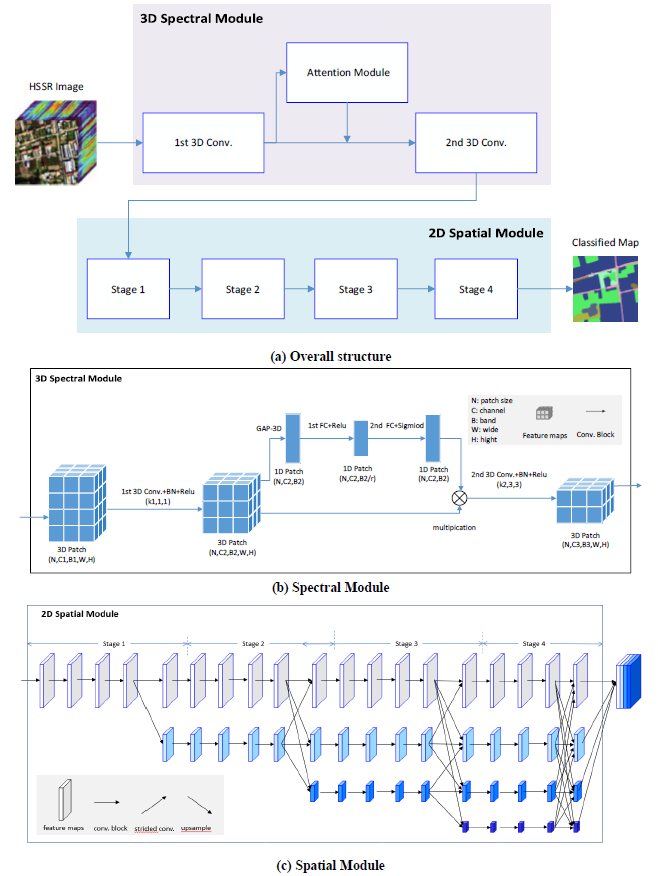

### 高光谱遥感影像语义分割——HRNet-3D


1.数据集组织格式
>数据集链接
>WHU_OHS:http://irsip.whu.edu.cn/resources/WHU_OHS_show.php
将数据集的影像（训练集和测试集的所有影像）放入"image"文件夹，训练集标签放入"train"文件夹，测试集标签放入"test"文件夹，标签的名字和对应影像的名字相同，例如，将数据组织成以下格式：

    └── data
         ├── image
         │    ├── 1.tif
         │    ├── 2.tif
         │    ├── 3.tif
         ├── train
         │    ├── 1.tif
         │    ├── 2.tif
         ├── test
         │    ├── 3.tif
    

2.网络训练

（1）修改config.py中的参数
    
"device_target": "CPU"或"GPU" 

"dataset_path" : 数据集根目录

"normalize": 是否对影像进行归一化，False或True，若为True，则逐波段进行标准差归一化

"nodata_value": 标签中的Nodata值（即不作为样本的像素值）

"in_channels": 输入通道数，即影像波段数

"classnum": 类别数

"batch_size": 训练集batchsize

"num_epochs": 训练迭代次数

"weight": 是否在损失函数中对各类别加权，默认为不加权（None），若需要加权，则给出一个各类别权重的list

"learning_rate": 训练学习率

"save_model_path": 训练模型保存文件夹路径

（2）执行cmd命令进行网络的训练

```
python train.py
```
3.网络测试

执行cmd命令

```
python eval.py --dataset_path xxx --checkpoint_path xxx --device_target xxx
```
进行网络的测试。其中--dataset_path为测试集根目录，--checkpoint_path为训练好的模型路径，--device_target为设备类型，包括CPU、GPU、Ascend

4.网络预测

执行cmd命令

```
python predict.py --input_file xxx --output_folder xxx --checkpoint_path xxx --device_target xxx
```
进行网络的预测。其中--input_file为输入的单张影像路径，--output_folder为输出的结果所在文件夹，输出结果文件名与输入影像相同，保存为tif格式，--checkpoint_path为训练好的模型路径，--device_target为设备类型，包括CPU、GPU、Ascend