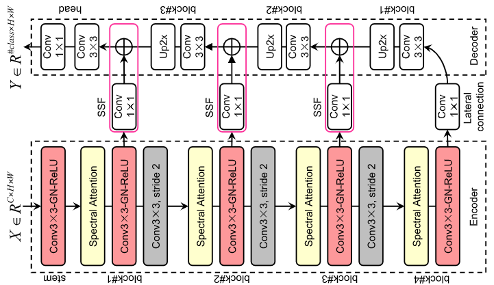
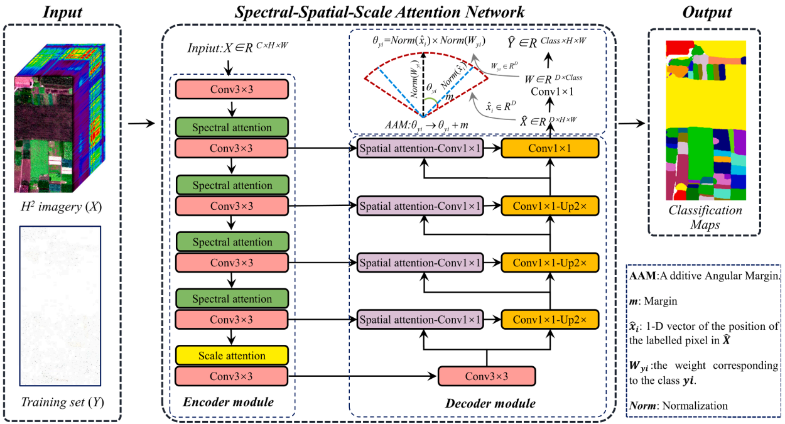

# 高光谱遥感影像语义分割

模型包含常用的语义分割网络如下：

1.FreeNet

论文：《FPGA: Fast Patch-Free Global Learning Framework for Fully End-to-End Hyperspectral Image Classification》 

链接：https://ieeexplore.ieee.org/document/9007624/references#references



2 S3ANet

论文：《S3ANet: Spectral-spatial-scale attention network for end-to-end precise crop classification based on UAV-borne H2 imagery》

链接：https://www.sciencedirect.com/science/article/pii/S0924271621002823



代码使用指南：
1.下载WHU-Hi数据集
http://rsidea.whu.edu.cn/resource_WHUHi_sharing.htm

将数据集裁切以后整理成如下格式：

    |──data 			
         |──WHU_Hi_XXX
              └──Training samples and test samples
              |    |──Train50.mat
              |    |──Test50.mat
              |    |──Train100.mat
              |    └─ ...
              └──WHU_Hi_XXX_gt.mat
              |
              |__WHU-Hi_XXX.mat
     
2.根据需求修改config中的参数

```python
# 模型架构参数设置
config = dict(
    model=dict(
        params=dict(
            in_channels=270,
            num_classes=22,
            block_channels=(96, 128, 192, 256),
            num_blocks=(1, 1, 1, 1),
            inner_dim=128,
            reduction_ratio=1.0,
            pool_outsize1=(944, 480),
            pool_outsize2=(472, 240),
            pool_outsize3=(236, 120),
            pool_outsize4=(118, 60)
        )
    ),

    # 训练数据路径设置
    num_class=22,
    image_shape=(940, 475),
    dataset=dict(
        type='FreeNet',
        params=dict(
            train_gt_dir= "Matlab_data_format/WHU-Hi-HongHu/Training samples and test samples/Train50.mat",
            train_gt_name='HHCYtrain50',
            train_data_dir= "Matlab_data_format/WHU-Hi-HongHu/WHU_Hi_HongHu.mat",
            train_data_name='WHU_Hi_HongHu',
            encoder_size=8
        )
    ),

    # 测试数据路径设置
    test=dict(
            type='FreeNet',
            params=dict(
                test_gt_dir= "Matlab_data_format/WHU-Hi-HongHu/Training samples and test samples/Test50.mat",
                test_gt_name='HHCYtest50',
                test_data_dir= "Matlab_data_format/WHU-Hi-HongHu/WHU_Hi_HongHu.mat",
                test_data_name='WHU_Hi_HongHu',
                encoder_size=8
            )
        ),

    # 参数和可视化图保存路径设置
    save_model_dir='./saved_ckpts/Honghu-HH-freenet.ckpt',
    picture_save_dir='./saved_ckpts/Honghu-HH-freenet.jpg',
)
```

3.设置完毕后，在cmd下运行`CUDA_VISIBLE_DEVICES=1 python train.py -c FreeNet_HC_config进行训练，这里可自己指定gpu id训练,FreeNet_HC_config.py是文件夹下对应的配置文件名称

4.训练好的模型会根据config中的参数保存在相应的目录下，选择合适的模型，使用eval.py进行测试，在cmd下运行`python eval.py -d XXX -c XXX -t xxx`进行测试验证，也可用`python eval.py --dataset_path xxx --checkpoint_path xxx --device_target xxx`进行测试验证，输出为验证集的各类别的precision、recall、F1精度指标

```
-d --dataset_path 为验证集根目录路径
-c --checkpoint_path为训练权重路径
-t --device_target为设备类型，包括CPU、GPU、Ascend
```

5.利用预训练好的模型对单张影像进行预测，选择合适的模型，使用prediction.py进行预测，在cmd下运行`python prediction.py -i XXX -o XXX -c1 XXX -c2 XXX -t XXX`进行预测，输出该影像对应地物分类的类别,也可运行`python prediction.py --input_file ./input_image --output_dir ./output.tif --checkpoint_path ./xxx/xx/xxx.ckpt –classes_file xxx.txt --device_target xxx`进行预测

```
-i --input_file 为输入的测试数据集地址
-o --output_dir 为输出的结果路径
-c1 --checkpoint_path为训练权重路径，
-c2 -- classes_file 为类别文件，xxx.txt文本文件中是所包含的类别名称，暂时不会用到
-t --device_target 为设备类型，包括CPU、GPU、Ascend
```